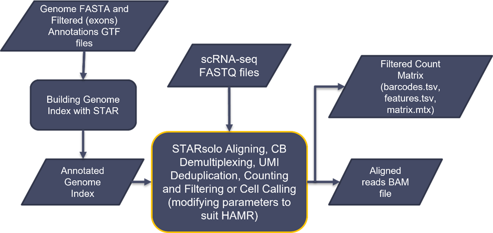
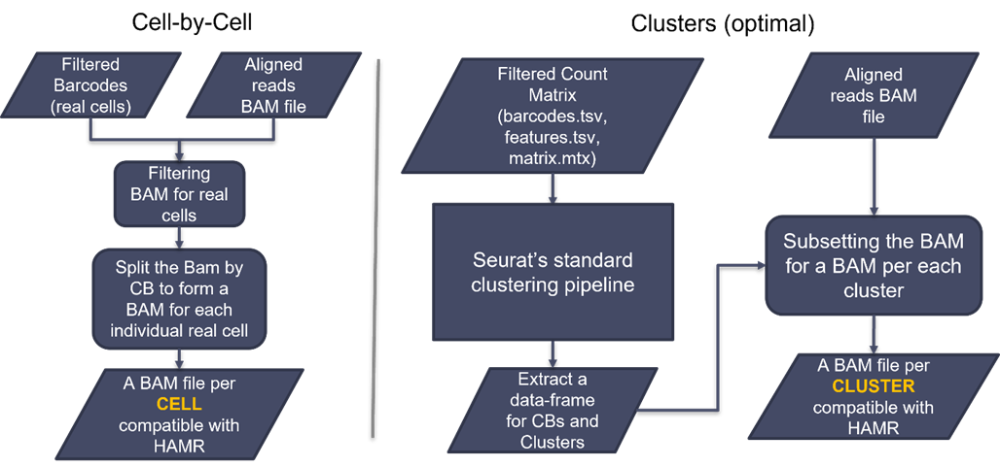

# scHAMR Pipeline Manual

## Table of Contents

1. scHAMR pipeline diagram
2. Prerequisites
3. Preprocessing
   - Starting up and loading the dataset
   - Building the genome index
   - Aligning the reads, CB demultiplexing, UMI deduplication, counting, and cell calling
4. Processing
   - Cell by cell as a potential option
   - Clustering
     - Option 1: Seurat in R
     - Option 2: Scanpy in Python
   - Obtaining a BAM file per cluster
5. Running HAMR
6. Example Runs
   - Drosophila Escort Cells
   - Human Pancreatic Islets

## 1. Pipeline Diagram



## 2. Prerequisites
The running environment: Bash terminal on a Linux-based operating system (with Standard POSIX programs)

#### Essential software and tools with versions
- Python (v.2.x & v.3.x)
- R (v.4.x)
- C compiler g++ (v.11.x)
- Bamtools (v.2.5.2)
- Samtools (v.1.16)
- STAR aligner (v.2.7.11a)
- SRA Toolkit (V.3.x)
- 10X Genomics subset-bam (v.1.1.0)

This software is not officially supported by 10X Genomics. If you have troubles installing the software, run the following commands to install:
```bash
mkdir subset_bam
cd subset_bam 
wget https://github.com/10XGenomics/subset-bam/releases/download/v1.1.0/subset-bam_linux
mv subset-bam_linux subset-bam
chmod +x ./subset-bam
export PATH=$PATH:~/software/subset_bam/
```
To operate the software, run one of the following commands:

```bash
./subset-bam  # if you are in the directory
subset-bam # if you exported the path
./ <full/path/to/subset-bam/directory>/subset-bam   # else
```


- 10X Genomics Cell Ranger (v.7.0.1)
- Seurat Package in R (v.4.0)
- HAMR (v.1.2)


## 3. Preprocessing

### 3.1. Starting up and Loading the Dataset

Commands to set up directories, load, and preprocess data

```bash
# creating a directory that will hold all the analyses
mkdir scHAMR
cd scHAMR

# loading the sample data from GEO in SRA format
mkdir SRR_data
cd SRR_data
prefetch <SRRxxxxxxxx> --max-size 200G
cd ~/ scHAMR

# converting it to FASTQ and spliting the files of reads (R1, R2, and possibly I1...).
mkdir FASTQ_data
cd FASTQ_data
fasterq-dump ~/scHAMR /SRR_data/<SRRxxxxxxxx> --split-files
ls
cd ~/scHAMR
```

### 3.2. Building the Genome Index

Although the annotations should not be added in building the genome index since HAMR requires no spliced junctions, STARsolo requires the annotations to run and produce the count matrix after aligning. The spliced junction problems will be solved during the aligning step. Additionally, the annotations file needs to be filtered for exons as recommended by 10Xgenomics and STARsolo to properly create the count matrix.


Commands for building genome index with STAR
 
```bash
# genome index directory
mkdir reference_genome
cd reference_genome

# loading required files: genome fasta and annotations GTF
wget <link for ensembl reference genome fasta file>
wget <link for ensembl annotations GTF file>
gzip -d *.gz

# filtering the annotations for exons
cellranger mkgtf <input.annotations_file.gtf> <output.annotations_filtered_file.gtf> --attribute=gene_biotype:protein_coding

# building genome index using STAR
STAR --runMode genomeGenerate --runThreadN 4 --genomeDir STAR_annotated_index/ --genomeFastaFiles <reference genome file.fa> --sjdbGTFfile <annotations_filtered_file.gtf> --genomeSAindexNbases 12 --genomeSAsparseD 3
cd ~/ scHAMR
```

### 3.3.	Aligning the Reads, CB Demultiplexing, UMI Deduplication, Counting and Cell Calling

STARsolo is used for this step since it provides flexibility in use to work within the constraints of HAMR as well as producing comparable results to CellRanger
1.	Spliced junctions for mRNA need to be filtered out. To filter them out in bulk RNA-seq, the STAR aligner parameter --alignIntronMax 1 is usually used along with not including the annotations file in the genome index step. That is because --alignIntronMax 1 only controls the unannotated junctions and has no control over the junctions annotated in building the genome index. However, the annotations file is required for scRNA-seq as discussed earlier in the genome index step. To fix this problem, the annotated spliced junctions can be filtered out by increasing increasing the overhang to a number bigger than the read length, --alignSJDBoverhangMin 999 (n> read length).
2.	The “CB” tag must be included in the --outSAMattributes and that the produced file is a sorted BAM (--outSAMtype BAM SortedByCoordinate ) because the "CB" tag will not be included otherwise and a sorted BAM is also a requirement by HAMR. The “CB” tag will be used to generate BAM file for each cell or cluster later.
3.	HAMR requires only uniquely mapped reads. The parameter --outFilterMultimapNmax 1 is used to filter out multiple mapped reads.
4.	Some parameters such as –soloType, --soloUMIlen and input fastq files are adjusted acording to the used kit. For example. here, the parameters are adjusted for the 10x chromium 3" V2 kit. For the 10X chromium 3" V3, add --soloUMIlen 12. Additionally, STARsolo requires the 10x Genomics cells barcodes whitelist, which is different for different kit versions, to check for correct CBs. Review the STAR Aligner manual for more details and guidance.
5.	HAMR and Subset-bam require the BAM to be sorted and indexed.


Commands for aligning the Reads, CB Demultiplexing, UMI Deduplication, Counting and Cell Calling with STAR

```bash
# loading the 10x Genomics cells barcodes whitelist
mkdir CB_whitelist
cd CB_whitelist
wget <link for CB whitelist txt file>
cd ~/scHAMR

# mapping with STARsolo
STAR --runThreadN 4   --genomeDir reference_genome/STAR_annotated_index/ --readFilesIn FASTQ_data/<Second file with actual cDNA reads.fastq>   FASTQ_data/<first file with CB(16b)+UMI(10b) reads.fastq>  --outFileNamePrefix STARsolo_results/   --outReadsUnmapped Fastx   --outSAMattributes NH   HI   NM   MD  CB UB sM sS sQ    --outFilterMultimapNmax 1   --outFilterMatchNmin 30   --outFilterMismatchNmax 4   --alignIntronMax 1   --alignSJDBoverhangMin 999   --soloType CB_UMI_Simple --soloCellFilter EmptyDrops_CR  --soloCBwhitelist CB_whitelist/<CB whitelist file.txt>  --outSAMtype BAM SortedByCoordinate

# indexing the resulted BAM
samtools index ~/scHAMR/STARsolo_results/Aligned.sortedByCoord.out.bam
```

The output of STARsolo includes the BAM file as well as raw and filtered count matrix in addition to other complementary files as summaries and logs. The filtered count matrix and BAM are required for the next steps.


## 4. Processing

### 4.1. Cell by Cell Analysis (Optional)

The Bam file generated in the previous step can technically be split to a BAM file per individual cell and then running them through HAMR for a HAMR result per each cell. Since the reads count per cell is relatively low compared to bulk seq data, even after filtering for actual cells, most HAMR results would be empty and inaccurate as HAMR requires adequate read depth. Additionally, that will generate so many BAM files, representing the number of cells detected, and we may not be interested to view hundreds of HAMR results.

Commands for optional cell by cell analysis

```bash
#  filtering the bam file to include the actual cells only using the filtered barcodes file generated by STARsolo
mkdir filtered_bam
cd filtered_bam
subset-bam --bam ~/scHAMR/STARsolo_results/Aligned.sortedByCoord.out.bam --cell-barcodes ~/scHAMR/STARsolo_results/Solo.out/Gene/filtered/barcodes.tsv --bam-tag CB:Z --out-bam filtered_bam --log-level debug
cd ~/scHAMR

# making sure that the allowed number of simultaneously openned files on the computer/server is bigger than the expected number of cells (number of filtered cells  barcodes). It is usually 1024. 
# Setting it temporarily to 9999.
ulimit -n
ulimit -n 9999
mkdir splitted_bams
```

### 4.2. Clustering

### Option 1: Seurat in R

```R
# R commands for clustering using Seurat
library(Seurat)
# ... additional commands for clustering and visualization
```

### Option 2: Scanpy in Python

```python
# Python commands for clustering using Scanpy
import scanpy as sc
# ... additional commands for data processing and clustering
```

## 5. Running HAMR

```bash
# Commands for running HAMR analysis on cluster or cell-level BAM files
mkdir HAMR_clusters
# ... further instructions for executing HAMR analysis
```

## 6. Example Runs

- Instructions and commands for example analyses on specific cell types.