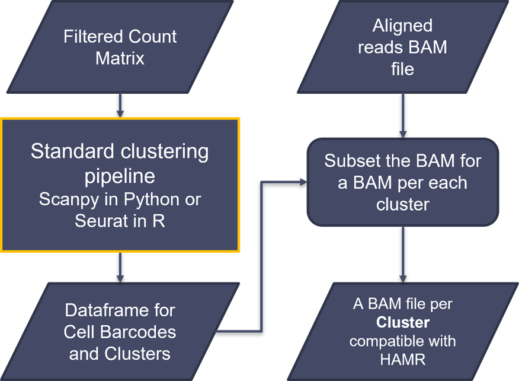

# scHAMR
scHAMR is a pipeline that adapts the High-throughput Annotation of Modified Ribonucleotides (HAMR) tool to single-cell resolution. HAMR identifies and classifies RNA covalent modifications transcriptome-wide at a single-nucleotide resolution. HAMR uses RNA-seq data mismatch patterns that are distinguishable from simple base-calling errors and produced by reverse transcriptase misincorporation at modified nucleotides. This pipeline enables researchers to apply HAMR analysis to single-cell RNA sequencing (scRNA-seq) data, opening new avenues for studying RNA modifications within individual cells and cell type and state clusters and offering an unprecedented scale of understanding cellular heterogeneity through an RNA covalent modifications lens and their implications in biology and disease.

scHAMR presents a pioneering adaptation of the High Throughput Annotations of Modified Ribonucleotides (HAMR) computational tool to single-cell resolution, enabling single-cell RNA sequencing (scRNA-Seq) data analysis within HAMR’s framework. The scHAMR pipeline addresses the challenges and leverages the opportunities presented by the surge in single-cell RNA sequencing technologies, offering an unprecedented scale of understanding cellular heterogeneity through an RNA covalent modifications lens.

## Background and Challenges
RNA modifications play a crucial role in regulating gene expression and cellular identity. The discovery of the FTO gene’s loss of function mutation’s risk in cancer, obesity, and diabetes further highlighted the epitranscriptome’s significance in human biology and disease as FTO is an RNA covalent modification ‘eraser’ (specifically, an M6A demethylase; Ryvkin et al., 2013). The HAMR algorithm development marked a significant advancement in detecting and classifying RNA modifications transcriptome-wide at a single-nucleotide resolution. HAMR uses RNA-seq data mismatch patterns that are distinguishable from simple base-calling errors and produced by reverse transcriptase misincorporation at modified nucleotides. HAMR only requires RNA-seq data as an input (Ryvkin et al., 2013). However, HAMR is not compatible with scRNA-seq, which provides high resolution, primarily due to the intrinsic complexity of the scRNA-seq data and HAMR’s strict data processing requirements.

## Methodology and Pipeline

The scHAMR pipeline seamlessly integrates several existing scRNAseq analysis tools and frameworks, involving several steps tailored to the specific requirements of HAMR:
1. Preprocessing:


2. Processing:


3. HAMR standard analysis.

## Outcomes and Results
Optimized and validated using scRNA datasets from Drosophila escort cells and human pancreatic islets, scHAMR has demonstrated its capability to effectively detect RNA modifications at a single-cell scale across different biological samples. These analyses and the pipeline’s manual are in this scHAMR repository.

## Conclusion and Future Directions
scHAMR represents a significant leap forward in single-cell epitranscriptomics, enabling the analysis of RNA modifications within individual cells and cell type and state clusters. Future directions include further validation of the results and refining the tool for enhanced sensitivity, specificity, and integration with emerging single-cell multi-omics platforms.

## Installation and Operation

This scHAMR repository provides users with a rich set of resources including:

1. scHAMR Manual: A full, detailed, and well-organized manual with complete instructions, and code is available. It ensures that users can  navigate the pipeline's features and utilize its functionality fully and smoothly. The manual encompasses all essential aspects from installations and setup to data preprocessing, data processing, running HAMR, and troubleshooting, among others.
   
2. Example Analyses: To illustrate the pipeline's capabilities and facilitate user understanding, the repository includes example analyses with their results:
* Drosophila Escorts
* Human Islets
Accompanying each example are datasets, codes, and instructions to replicate the analyses and results, emphasizing the pipeline's reproducibility and transparency.


```graph

scHAMR/                            # scHAMR repository
│
├── scHAMR-manual/                 # manual directory
│   ├── pip1.png                   # pipeline part I diagram
|   ├── pip2.png                   # pipeline part II diagram
|   └── README.md                  # Detailed manual
│
├── HAMR/HAMR-1.2/                 # HAMR installation
│
├── example-runs/                  # Directory for the example scHAMR runs
│   ├── drosophila-escorts/        # Drosophila escorts dataset example
│   |    ├── scripts/              # All scripts and instructions to replicate the scHAMR analysis on this dataset
│   |    └── scHAMR/               # scHAMR pipeline drosophila escorts results  
│   └── human-islets/              # Human pancreatic islets dataset example
│        ├── scripts/              # All scripts and instructions to replicate the scHAMR analysis on this dataset
│        └── scHAMR/               # scHAMR pipeline human islets results  
| 
├── .gitattributes                 # Git large file storage (LFS)
├── .gitignore                     # Git ignore
└── README.md                      # This file

```

# Contributions
Contributions are welcome. Please fork the repository and submit a pull request with your proposed additions or changes.

# Licence
